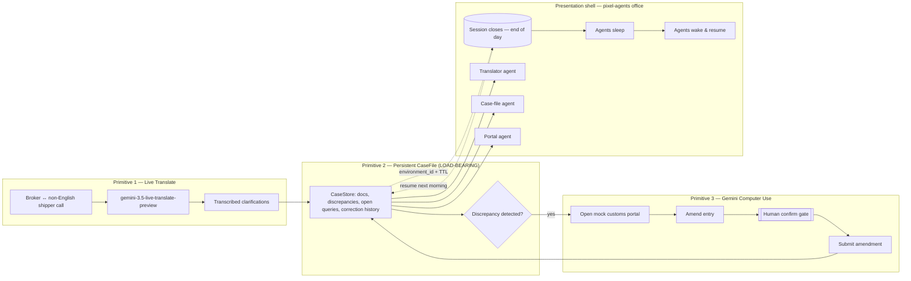

# ClearBorder — Implementation Plan (Google Antigravity)

> **Event:** RAISE Summit Hackathon (Cerebral Valley × Google DeepMind), Paris — 24 h format
> **Track:** *Statement Four* — chained primitives where a later primitive fires **only because** an earlier one is running
> **Judging weight:** Impact 25 % · Demo 50 % · Creativity 15 % · Pitch 10 %
> **Build surface:** Google Antigravity (agent-first IDE, Gemini 3 Pro) + a light fork of `pixel-agents` as the presentation shell
> **Version:** v1.0 — build-day plan

---

## 0. How to drive this plan inside Antigravity

Antigravity is agent-first: you give the Agent Manager a **goal**, it produces an *Implementation Plan* artifact and a *Task* artifact, executes across editor + terminal + browser, and returns a *Walkthrough* (screenshots + file changes) you approve. This document is written to feed that loop.

**Recommended setup (do this first, ~10 min):**

1. **Mode:** Use **Agent-Assisted** for Phases 0–2 and 4 (agent runs, pauses at checkpoints). Use **Review-Driven** for Phase 3 (Computer Use / anything that "submits") — human judgment on the submit gate is the whole point of that phase.
2. **Model:** Gemini 3 Pro as the brain. Keep Claude Sonnet available as a fallback reasoning model if a phase stalls.
3. **Project skill:** Create `.agents/skills/clearborder/SKILL.md` (template in Appendix D). Antigravity loads it on-demand and keeps every agent on-spec — scope, banned categories, the load-bearing primitive, and the demo golden path.
4. **One project, three loose surfaces:** a `server/` (Node, holds all API keys), a `console/` (the live-call web UI), a `portal/` (the mock customs portal Computer Use drives), and `office/` (the pixel-agents fork). Antigravity Projects scope permissions per folder — keep secrets in `server/` only.

**Kickoff prompt to paste into the Agent Manager (Phase 0):**

> Build the scaffold for "ClearBorder", a B2B customs-clearance agent. Read `.agents/skills/clearborder/SKILL.md` first and follow it exactly. Create a TypeScript monorepo with four workspaces: `server` (Node + Fastify + WebSocket, holds all Gemini keys), `console` (Vite + React live-call UI), `portal` (a standalone mock customs portal web app), and `office` (placeholder for the pixel-agents fork). Add a shared `packages/core` with the `CaseStore` interface and `CaseFile` types from the skill. Produce a runnable `npm run dev` that starts all four. Do not call any external government system. Verify by launching all services and screenshotting each home route.

**Golden rule (put it on the wall):** if time runs short, cut UI polish before the persistence layer. The primitive that *resumes on stage* is what wins Statement Four.

---

## 1. Business case (grounding for the agent and the pitch)

**Product:** ClearBorder — an autonomous customs-clearance agent for SME exporters and customs brokers that survives the multi-day "hold."

**The wedge (one sentence):** Most agents work from a snapshot and forget; customs clearance takes days, so an agent that forgets is useless — ClearBorder remembers every correction and every open customs query, and each morning resumes exactly where it stopped.

**Market:** Trade documentation costs run at up to ~7 % of ~$12 T of annual trade (OECD framing). A single mismatch across invoice / packing list / HS code triggers a hold that immobilizes a shipment for days. The pain is horizontal (every exporter), chiffrable (quantifiable), and recurring.

**ICP:** SME exporters and their customs brokers. Buyer feels the pain per shipment; the product reads as SaaS, not a hackathon toy.

**Why it lands with enterprise judges:** "looks like a product, not a project"; genuine multi-day agent autonomy; the theme *state/knowledge must not be lost* is a recurring winning motif.

---

## 2. Architecture — the chain and the shell

**The chain (Statement Four core):** primitive #2 is load-bearing; #3 only fires because #2 flagged a specific document discrepancy.



**Flow in words:** `Live Translate (call)` → `persistent CaseFile (discrepancy detected)` → `Computer Use (portal correction)` → `human confirm` → `session closes` → `resume next morning via environment_id`.

**The presentation shell (the creative differentiator):** `pixel-agents` renders three named agents in a pixel-art office — **Translator**, **Case-file**, **Portal** — animating from real backend events (walk / type / read / waiting-for-input speech bubble). At "end of day" they go idle; on "resume" they wake and pick the case back up. This makes the persistence *visible* and sidesteps the banned "dashboard-as-main-feature" category — it's a game-like control room, not a dashboard.

---

## 3. Tech stack & repository layout

| Layer | Choice | Why |
|---|---|---|
| Language | TypeScript everywhere | Matches `pixel-agents` (TS/React) and the `@google/genai` SDK |
| Backend | Node 20 + Fastify + `ws` | Server-to-server Live API, holds keys, mints ephemeral tokens |
| Live call UI | Vite + React (`console/`) | Mic capture, transcript, discrepancy panel |
| Persistence | `CaseStore` interface → `InteractionsCaseStore` (preview API) **or** `LocalCaseStore` (SQLite via `better-sqlite3`) | Abstraction = demo safety; local fallback always works |
| Computer Use | `gemini-2.5-computer-use` driving a headless/visible browser | Amends the mock portal |
| Mock portal | Standalone React app (`portal/`) that *looks* like a real customs entry system | Target for Computer Use; must look credible |
| Office shell | Fork of `pixel-agents` (`office/`) + a `clearborder` adapter | The visible "wow" |

```
clearborder/
├─ .agents/skills/clearborder/SKILL.md   # Antigravity project skill (Appendix D)
├─ packages/
│  └─ core/                              # CaseFile types + CaseStore interface + discrepancy rules
├─ server/                               # Fastify + WS; ALL secrets live here
│  ├─ src/live-translate.ts              # Live API session, transcripts → CaseFile
│  ├─ src/case-store/                    # InteractionsCaseStore + LocalCaseStore
│  ├─ src/computer-use.ts               # CU loop over the mock portal, confirm gate
│  ├─ src/orchestrator.ts               # chains the primitives, emits office events
│  └─ src/events.ts                      # WS bus: agent activity → office
├─ console/                              # live-call operator UI (React)
├─ portal/                               # mock customs portal (React)
├─ office/                               # pixel-agents fork + adapters/clearborder
└─ scripts/demo/                         # scripted "overnight resume" golden path + seed data
```

---

## 4. The load-bearing abstraction: `CaseStore`

This is the heart of the product. Build it in `packages/core` **first** and make everything depend on it.

```ts
// packages/core/src/case.ts
export type DocKind = "invoice" | "packing_list" | "hs_code" | "value_proof";

export interface Discrepancy {
  id: string;
  kind: string;                 // e.g. "value_mismatch_invoice_vs_packing_list"
  detail: string;               // human-readable
  status: "open" | "amended" | "confirmed" | "submitted";
  openedAt: string;
  resolvedAt?: string;
}

export interface CustomsQuery {           // a question the portal/authority is waiting on
  id: string;
  question: string;
  answer?: string;
  status: "pending" | "answered";
}

export interface CaseFile {
  caseId: string;
  environmentId: string;        // the resume key — TTL resets on use
  shipment: { ref: string; origin: string; destination: string; hsCode?: string };
  documents: Partial<Record<DocKind, { value: string; source: "call" | "portal" | "upload" }>>;
  discrepancies: Discrepancy[];
  openQueries: CustomsQuery[];
  corrections: { at: string; field: string; from?: string; to: string; by: "agent" | "human" }[];
  lastTouchedAt: string;
  day: number;                  // demo clock: 1, 2, ...
}

export interface CaseStore {
  create(seed: Partial<CaseFile>): Promise<CaseFile>;
  get(caseId: string): Promise<CaseFile | null>;
  resume(environmentId: string): Promise<CaseFile | null>;   // <- the money method
  append(caseId: string, patch: Partial<CaseFile>): Promise<CaseFile>;
  detectDiscrepancies(caseId: string): Promise<Discrepancy[]>;
}
```

**Two implementations, one interface:**
- `InteractionsCaseStore` — wraps the preview persistent-environment / Interactions API (`environment_id`, ~7-day TTL that resets on use). Confirm the exact surface in AI Studio at build time.
- `LocalCaseStore` — SQLite-backed, identical behavior. This is the demo-safe default: it still proves "state survives a full session close and resumes," which is exactly what Statement Four rewards.

**Wire selection via env:** `CASE_STORE=interactions|local`. Demo runs on `local`; flip to `interactions` if the preview API is stable an hour before judging. **Never** let the demo depend on a live preview call you can't guarantee.

---

## 5. Phased build plan (mapped to 24 h)

Each phase = one Agent Manager goal. Ship a working slice each phase; integrate continuously.

### Phase 0 — Scaffold, mock portal, `CaseStore` (0–2 h)
- **Goal:** Runnable monorepo; `CaseStore` interface + `LocalCaseStore`; mock portal that looks like a real customs entry form; `npm run dev` starts everything.
- **Files:** `packages/core/*`, `server/src/case-store/local.ts`, `portal/*`, root scripts.
- **Acceptance:** All four services boot; `LocalCaseStore.create/get/resume/append` pass a unit test; portal renders an entry with fields for invoice value, packing-list value, HS code, and a "value proof" upload.
- **Verify (Antigravity):** launch all services, screenshot each; run `npm test` for core.
- **Prompt:** *(the Kickoff prompt in §0)*

### Phase 1 — Live Translate → CaseFile (2–6 h)
- **Goal:** A broker↔shipper call in the console. Non-English speech is translated live; clarifications ("declared value includes freight") are written into the CaseFile.
- **Files:** `server/src/live-translate.ts`, `console/*`, `server/src/events.ts`.
- **Key API:** `@google/genai` `ai.live.connect({ model: "gemini-3.5-live-translate-preview", config: { responseModalities:[Modality.AUDIO], inputAudioTranscription:{}, outputAudioTranscription:{}, translationConfig:{ targetLanguageCode, echoTargetLanguage:true } } })`. Backend mints an **ephemeral token** (v1alpha) so the browser never sees the API key; lock `translationConfig` server-side.
- **Acceptance:** Speaking in language X yields streamed translated audio + input/output transcripts in the console; pressing "capture as fact" appends a document value to the CaseFile with `source:"call"`.
- **Verify:** replay a seeded audio clip → transcript appears → CaseFile shows the captured value.
- **Prompt:** *"Implement `server/src/live-translate.ts` using `@google/genai` Live API with model `gemini-3.5-live-translate-preview`. Backend opens the session and mints a v1alpha ephemeral token with a locked translationConfig; the `console` React app streams mic audio over WebSocket, plays translated audio, and shows both transcripts. Add a 'Capture as fact' button that POSTs a `{docKind, value}` to the server, which calls `caseStore.append`. Verify with the seeded clip in `scripts/demo/seed-call.*` and screenshot the transcript + updated CaseFile."*

### Phase 2 — Persistent CaseFile, discrepancy detection, resume (6–12 h) — **CORE, top priority**
- **Goal:** The CaseFile persists across a full process restart. `detectDiscrepancies` flags invoice-vs-packing-list value mismatch and missing HS code. `resume(environmentId)` returns the exact prior state.
- **Files:** `server/src/case-store/*`, `server/src/orchestrator.ts`, discrepancy rules in `packages/core`.
- **Acceptance:** (1) Create case, append facts, **kill the server**, restart, `resume(environmentId)` returns identical discrepancies + corrections + open queries. (2) A value mismatch produces an `open` discrepancy with a human-readable `detail`. (3) `day` increments on resume and `lastTouchedAt` refreshes the TTL.
- **Verify:** an automated test that boots → seeds → **hard-restarts** → resumes → asserts deep-equality of state. This test *is* your Statement-Four proof; keep it green.
- **Prompt:** *"Implement `LocalCaseStore` (better-sqlite3) behind the `CaseStore` interface, plus discrepancy rules: value_mismatch (invoice vs packing_list) and missing_hs_code. Add an integration test that creates a case, appends facts, terminates and restarts the process, calls `resume(environmentId)`, and asserts the full CaseFile is byte-identical and discrepancies persisted. Increment `day` and refresh TTL on resume. This persistence-survives-restart test must pass — treat it as the definition of done."*

### Phase 3 — Computer Use amends the mock portal, human confirm gate (12–18 h)
- **Goal:** *Because* the CaseFile holds an open discrepancy, the agent opens the mock portal, navigates to the entry, amends the flagged field, then **pauses for human confirmation before submitting.**
- **Files:** `server/src/computer-use.ts`, confirm-gate UI in `console/`.
- **Key API:** `gemini-2.5-computer-use` in a screenshot→action loop over the `portal/` app (Playwright-driven browser). Actions gated: the loop **must stop** before the final "Submit" and emit a `needs_confirmation` event; only an explicit human approve calls submit. Record the correction into `case.corrections` with `by:"human"` on approval.
- **Acceptance:** Given an open `value_mismatch`, the agent fills the corrected value in the portal, stops at submit, shows a confirm card in the console; on approve, it submits and the discrepancy flips to `submitted`; on reject, nothing is sent.
- **Verify:** Antigravity's own browser verification can watch the portal and screenshot the pre-submit state — use it. Confirm no submit happens without approval.
- **Prompt:** *"Implement a Gemini 2.5 Computer Use loop (Playwright) that, triggered by an open discrepancy in the CaseFile, opens the `portal` app, locates the shipment entry, and corrects the flagged field. Hard rule: the loop must halt before clicking Submit and emit `needs_confirmation`; only an explicit human approval from the console triggers the actual submit and records the correction with `by:'human'`. Verify the pre-submit pause with a screenshot and confirm rejection sends nothing."*

### Phase 4 — Pixel-agents office visualization (integrate alongside Phases 2–3)
- **Goal:** Three characters (Translator, Case-file, Portal) animate from real backend events; at "end of day" they idle, on "resume" they wake.
- **Files:** `office/` (fork of `pixel-agents`), `office/adapters/clearborder/*`.
- **Integration strategy (lowest-risk first):**
  - **Primary — event adapter:** `pixel-agents`' webview already has a character state machine (idle → walk → type/read) fed by an activity stream. Add a small `clearborder` adapter that subscribes to the server's WebSocket event bus (`server/src/events.ts`) and maps case events → character states: `live_translate_active → Translator types`, `discrepancy_detected → Case-file reads`, `computer_use_step → Portal types`, `needs_confirmation → speech bubble (waiting)`, `day_closed → all idle/sleep`, `resumed → wake + walk to desks`.
  - **Fallback — transcript mimicry:** `pixel-agents` natively tails Claude-Code-style JSONL. If the adapter runs long, have the orchestrator also write a JSONL activity log per agent in that format and point the unmodified extension at it.
  - **Backstop — pre-recorded office:** capture a clean office run as video for the demo reel.
- **Acceptance:** Running the golden path animates all three agents in sync with real events, and the resume visibly wakes them.
- **Verify:** screen-record the office during the scripted run; confirm the sleep→wake transition on resume.
- **Prompt:** *"Fork `pixel-agents` into `office/`. Add `office/adapters/clearborder` that connects to the server WebSocket event bus and drives three named characters (Translator, Case-file, Portal) via the existing character state machine. Map: live_translate_active→type, discrepancy_detected→read, computer_use_step→type, needs_confirmation→waiting speech bubble, day_closed→idle, resumed→walk-to-desk. Keep a fallback that tails a Claude-Code-style JSONL the orchestrator writes. Verify by screen-recording a full run including the resume wake-up."*

### Phase 5 — End-to-end golden path + pitch (18–24 h)
- **Goal:** One replayable script runs Day 1 (call → discrepancy → correction → confirm → **session close**) and Day 2 (**resume** → retrieve yesterday's validated correction → submit) with zero live risk.
- **Files:** `scripts/demo/golden-path.*`, seed data, recorded audio, a "Day +1" button that closes and resumes.
- **Acceptance:** From a cold start, the operator clicks through the full story in <3 min; the resume never re-collects information; the office animates throughout.
- **Verify:** run it end-to-end 3× back-to-back; if any step needs a live preview call, ensure a recorded fallback exists.

---

## 6. Demo script (the replayable "overnight resume")

1. **Day 1 — the call (35 s).** Operator dials the non-English shipper. Live Translate streams both sides. Shipper says the declared value includes freight → operator "captures as fact." CaseFile lights up; **Translator** agent types in the office.
2. **Discrepancy (20 s).** CaseFile flags invoice ≠ packing-list value → **Case-file** agent reads; an `open` discrepancy appears with a plain-English detail.
3. **Computer Use correction (35 s).** *Because* of that discrepancy, the **Portal** agent opens the customs portal and amends the value — then **stops at submit** and raises a confirm card. Operator approves. Discrepancy → `submitted`.
4. **End of day (10 s).** Operator clicks "Close session (Day +1)." Server process is genuinely torn down. Office agents go to sleep. *"Everything the other agents forget, ClearBorder keeps."*
5. **Day 2 — the wow (30 s).** Cold `resume(environmentId)`. Office agents **wake**. The agent retrieves yesterday's validated correction and the pending customs query, and submits the amendment — **without re-collecting a single fact.** *"It resumed exactly where it stopped."*

**On-stage safety:** run everything from `scripts/demo/golden-path` against `CASE_STORE=local` with recorded audio. Live preview APIs are a bonus, never a dependency.

---

## 7. Risk register & fallbacks

| Risk | Mitigation |
|---|---|
| Preview APIs unstable (Live Translate / Interactions / Computer Use) | `CaseStore` abstraction + `LocalCaseStore`; recorded audio; pre-recorded office backstop. Demo runs offline-safe. |
| Mock portal looks fake | Spend real polish on the `portal/` form — realistic fields, headers, a plausible authority name. Credibility sells the Computer Use step. |
| Computer Use submits without approval | Hard architectural gate: submit is a separate function only reachable via a human-approved event. Covered by a test. |
| Pixel-agents adapter eats time | Ship the JSONL-mimicry fallback; office is a *bonus* layer, never blocks the chain. |
| Scope drift into legal/reg advice | SKILL.md forbids it; stay strictly on coordination/clearance. |
| Banned categories (mental health, basic RAG, Streamlit, dashboard-as-main-feature, drone) | None apply; the office is a game shell, the load-bearing primitive is persistent state. No hardware. |

---

## 8. Judging alignment

| Criterion | Weight | How ClearBorder scores |
|---|---|---|
| Impact | 25 % | Horizontal, quantifiable market; real, costly hold problem; reads as B2B SaaS. |
| Demo | 50 % | Full 3-primitive chain + replayable overnight resume, visualized in a live office, no hardware. |
| Creativity | 15 % | Multi-day persistence as the backbone; the "case that survives the hold," shown as agents that sleep and wake. |
| Pitch | 10 % | Clean "snapshot vs memory" narrative; quantified market; the resume is a *seen*, not claimed, moment. |

---

## Appendix A — Live Translate connection (server, reference)

```ts
import { GoogleGenAI, Modality } from "@google/genai";
const ai = new GoogleGenAI({}); // key from server env only

export async function openTranslateSession(targetLanguageCode: string) {
  return ai.live.connect({
    model: "gemini-3.5-live-translate-preview",
    config: {
      responseModalities: [Modality.AUDIO],
      inputAudioTranscription: {},
      outputAudioTranscription: {},
      translationConfig: { targetLanguageCode, echoTargetLanguage: true },
    },
    callbacks: {
      onmessage: (m) => {
        const c = m.serverContent;
        if (c?.inputTranscription) pushTranscript("in", c.inputTranscription.text);
        if (c?.outputTranscription) pushTranscript("out", c.outputTranscription.text);
        for (const p of c?.modelTurn?.parts ?? [])
          if (p.inlineData) streamAudioToClient(p.inlineData.data); // base64
      },
    },
  });
}
```
For the browser client, mint a **v1alpha ephemeral token** on the server with the `translationConfig` locked so clients can't tamper with it.

## Appendix B — Computer Use loop (shape)

```ts
// screenshot -> model proposes action -> execute -> repeat, HALT before submit
async function amendEntry(caseFile: CaseFile, page: Page) {
  while (true) {
    const shot = await page.screenshot();
    const step = await proposeAction("gemini-2.5-computer-use", shot, caseFile);
    if (step.action === "submit") {                 // gate
      emit("needs_confirmation", { caseId: caseFile.caseId, step });
      return;                                        // wait for human approve elsewhere
    }
    await execute(step, page);                       // click/type/scroll
    emit("computer_use_step", { caseId: caseFile.caseId, step });
  }
}
```

## Appendix C — Environment variables

```
GEMINI_API_KEY=            # server only, never shipped to console/
CASE_STORE=local           # local | interactions
DEMO_MODE=true             # use recorded audio + seeded case
PORTAL_URL=http://localhost:5174
```

## Appendix D — `.agents/skills/clearborder/SKILL.md` (project skill)

```md
---
name: clearborder
description: Build ClearBorder, a B2B customs-clearance agent that chains Live Translate,
  a persistent CaseFile (load-bearing), and Gemini Computer Use, with a pixel-agents office shell.
  Load whenever building any ClearBorder component.
---

# ClearBorder build rules

## What we are building
An autonomous customs-clearance agent for SME exporters/brokers. Clearance takes days; the product's
whole value is that state survives session close and resumes each morning exactly where it stopped.

## The chain (never break the order)
Live Translate (call) -> persistent CaseFile detects a discrepancy -> Computer Use amends the mock
portal -> human confirms -> session closes -> resume(environmentId) next day.

## Load-bearing primitive
The persistent CaseFile. Everything depends on the `CaseStore` interface. Default to `LocalCaseStore`
for demos; `InteractionsCaseStore` only if the preview API is confirmed stable. Persistence-survives-
restart is the definition of done for Phase 2.

## Hard rules
- Never contact any real government/customs system. The portal is a local mock.
- Computer Use must HALT before Submit and require explicit human approval.
- All secrets stay in `server/`. The console gets ephemeral tokens only.
- No legal/regulatory advice. Stay on coordination/clearance.
- Banned categories to avoid: mental health, basic RAG, Streamlit, dashboard-as-main-feature, hardware/drone.
  The office view is a game-like control room, not a dashboard.

## Demo golden path (keep runnable)
scripts/demo/golden-path runs Day 1 (call->discrepancy->correction->confirm->close) and Day 2
(resume->retrieve validated correction->submit) with recorded audio and CASE_STORE=local.
```

---

*Preview-API surfaces (Live Translate, Computer Use, and the persistent-environment/Interactions layer) evolve; confirm exact model IDs, token flow, and the `environment_id`/TTL contract in Google AI Studio at the start of the build. The `CaseStore` abstraction exists precisely so a surface change never touches your demo.*
