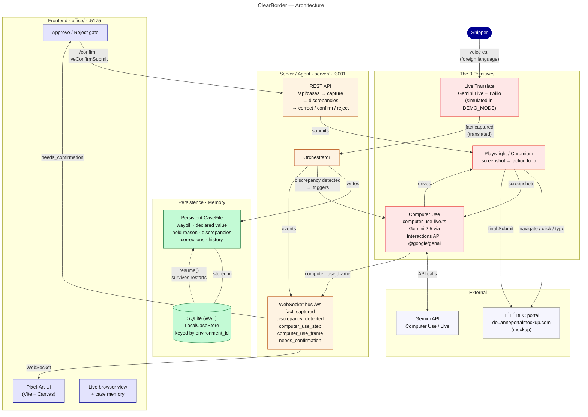

# ClearBorder

**The AI agent that gets packages out of customs.**

A package is stuck at the border: the shipper fat-fingered the declared value ($240.00 instead of $2,400.00). ClearBorder picks up the case, **calls the shipper in Mandarin** (translating live in both directions), **operates the customs portal like a human** — finds the case, corrects the error, and pauses for your approval before anything irreversible — then **goes to sleep and wakes up the next day** exactly where it left off, across as many days as the case takes. Along the way it builds **persistent memory**: episodic (what happened), semantic (what it knows), procedural (how things are done) — and learns shipper-specific patterns it applies to future cases.

Built for a Google DeepMind competition on agents with persistent memory over long-horizon tasks.


---

## ClearBorder V2 (Statement Four hackathon build)

Minimalist **sender app** — Upload → Process → Verify. No dashboards. Human-in-the-loop before final portal submit.

**Spec:** [`CLEARBORDER_V2_SPEC.md`](./CLEARBORDER_V2_SPEC.md) · [`clearborder_v2_spec.json`](./clearborder_v2_spec.json)

### Quickstart V2

```bash
# 1. Python backend deps (once)
python3 -m venv backend/.venv
source backend/.venv/bin/activate
pip install -r backend/requirements.txt
playwright install chromium

# 2. Node frontend deps
pnpm install
pnpm seed:v2   # generates backend/fixtures/mock_invoice.pdf

# 3. Environment (GEMINI_API_KEY already in .env — never commit)
cp .env.example .env

# 4. Run V2 stack
pnpm dev:v2    # backend :8000, sender app :3001
```

| Surface | URL | Notes |
| --- | --- | --- |
| **Sender app** | http://localhost:3001 | Drag-drop invoice → poll state → approve diff |
| **V2 API** | http://localhost:8000 | `POST /api/upload`, `GET /api/state/{id}`, `POST /api/approve/{id}` |
| **Mock customs portal** | http://localhost:8000/mock-customs/login | `broker.demo` / `clearborder2026` |
| Seed waybill | `WB-2026-448291` | Portal holds **$240.00**; invoice corrects to **$2,400.00** |

**State machine:** `PENDING_UPLOAD` → `EXTRACTED` → `PORTAL_SYNCING` → `AWAITING_APPROVAL` → `COMPLETED` (or `EXCEPTION_HOLD`)

Automation fills the portal and saves draft but **never clicks** `#gatekeeper-submit-btn`. Broker approves in the sender app, then submits manually on the mock portal.

### V2 tests

```bash
# Terminal 1
pnpm dev:v2:backend

# Terminal 2
pnpm test:v2
# or: curl -F file=@backend/fixtures/mock_invoice.pdf http://localhost:8000/api/upload
```

`verify_state_hydration('env_test_id')` is exposed at `GET /api/verify/hydration/env_test_id` (seeded on backend startup).

### V2 layout

```
backend/          FastAPI + SQLite + Playwright portal sync
frontend/         Next.js minimalist sender app
clearborder_v2_spec.json
CLEARBORDER_V2_SPEC.md
```

V1 (`apps/web`, `apps/agent`) still runs via `pnpm dev` on ports 3000 / 8787 — stacks are independent.

---

## Quickstart

```bash
pnpm install
pnpm seed     # create + populate data/clearborder.db (idempotent, resets demo state)
cp .env.example .env   # add GEMINI_API_KEY for real agent (never commit .env)
pnpm dev      # web on :3000, agent service on :8787
```

| Surface | URL | Notes |
| --- | --- | --- |
| **Agent demo** (internal observer) | http://localhost:3000 | Operator story feed — press **`D`** → play **Day 1 / 2 / 3** |
| **TradeGate** (mock customs portal) | http://localhost:3000/portal/login | `a.mercier` / `demo2026` |
| Agent service health | http://localhost:8787/health | WS `/ws` · SSE `/events` · shows active modes |

Copy `.env.example` → `.env` and set `GEMINI_API_KEY` for the real orchestrator. Without it, the demo replayer still works; computer use falls back to scripted Playwright.

### Running the demo (scripted replayer)

1. Open the live demo at `/`, press **`D`**, click **Day 1**. The agent discovers the valuation hold, calls the shipper (zh↔en transcript inline), amends the declaration on TradeGate, and stops at an **approval modal** — click **Approve & submit**. The agent finishes the submission and goes to sleep.
2. Press **`D`** → **Day 2**: the agent wakes with a recap, finds the customs officer's new document request, recalls the needed certificate **from a case it handled in March**, uploads it, sleeps again.
3. Press **`D`** → **Day 3**: declaration cleared. The agent writes the learned pattern (*"this shipper misplaces decimals — call first"*) to the shipper's profile.

**Reset demo state** any time from the `D` menu, or `pnpm seed`.

### Running the real agent (intake → portal → approval → sleep → wake)

1. Set `GEMINI_API_KEY` in `.env` (billing-linked for computer use; free tier works for Live/embeddings with limits).
2. `pnpm dev` — agent probes Gemini at startup; if computer use fails, auto-falls back to `scripted` (logged clearly).
3. Open http://localhost:3000 → **Submit a real case** with passport ID, importer, declared vs invoice values (use 240 / 2400 to trigger the valuation-hold flow).
4. Watch the story feed: agent recalls memories → calls shipper (`VOICE_MODE=mock` by default) → Playwright fills TradeGate → **approval modal** → approve → agent sleeps (~30s with default `DEMO_TIME_COMPRESSION=30000`).
5. After sleep, the wake scheduler fires automatically, or use **Wake agent** in the `D` menu / `POST /api/agent/wake/:caseId`.

**Env flags**

| Variable | Values | Default |
| --- | --- | --- |
| `COMPUTER_USE_MODE` | `gemini` \| `scripted` | `gemini` (auto-fallback) |
| `VOICE_MODE` | `mock` \| `browser` \| `twilio` | `browser` (Gemini Live in-browser; mock fallback on timeout) |
| `TWILIO_ACCOUNT_SID` / `TWILIO_AUTH_TOKEN` / `TWILIO_PHONE_NUMBER` | Twilio credentials | empty — required for `VOICE_MODE=twilio` |
| `PUBLIC_AGENT_URL` | Public HTTPS base (ngrok), no trailing slash | empty — Twilio webhooks + WSS |
| `SHIPPER_PHONE_NUMBER` | Outbound demo target (E.164, verified on trial) | empty |
| `GEMINI_LIVE_MODEL` | Gemini Live model for PSTN bridge | `gemini-2.5-flash-native-audio-preview-12-2025` |
| `DEMO_TIME_COMPRESSION` | ms per “business day” | `30000` |
| `BROWSER_HEADLESS` | `true` \| `false` | `true` |

**Agent API (real orchestrator)**

- `POST /api/cases/intake` — create case + start agent
- `GET /api/cases/:id` — case status + orchestrator phase
- `POST /api/approval` — human-in-the-loop gate (orchestrator or replayer)
- `POST /api/agent/wake/:caseId` — manual wake for demo

### Twilio PSTN voice (real phone ↔ Gemini Live)

ClearBorder bridges **Twilio Media Streams** (8 kHz μ-law PSTN) to **Gemini Live** (16 kHz in / 24 kHz out PCM) inside `apps/agent`. Architecture:

```
Your phone ──► Twilio Voice ──► POST /twilio/voice (TwiML)
                                    │
                                    ▼
                         wss://PUBLIC_AGENT_URL/twilio/stream
                                    │
                    μ-law ↔ PCM resample (stateful, no clicks)
                                    │
                                    ▼
                         Gemini Live (server-side API key)
                                    │
                                    ▼
                         call.* AgentEvents → demo story feed
```

**Dependencies:** `twilio`, `alawmulaw` (in `apps/agent`).

**Setup**

1. Copy `.env.example` → `.env` and set `GEMINI_API_KEY` (already working) plus:

   ```bash
   VOICE_MODE=twilio
   TWILIO_ACCOUNT_SID=AC…
   TWILIO_AUTH_TOKEN=…
   TWILIO_PHONE_NUMBER=+1…          # your Twilio number
   SHIPPER_PHONE_NUMBER=+1…         # verified outbound target (trial)
   PUBLIC_AGENT_URL=https://xxxx.ngrok-free.app   # NO trailing slash
   GEMINI_LIVE_MODEL=gemini-2.5-flash-native-audio-preview-12-2025
   ```

2. Expose the agent (Twilio needs public HTTPS + WSS, not localhost):

   ```bash
   pnpm dev                              # agent on :8787
   ngrok http 8787                       # copy https URL → PUBLIC_AGENT_URL
   ```

3. **Twilio Console** → [Phone Numbers](https://console.twilio.com/us1/develop/phone-numbers/manage/incoming) → your number → **Voice configuration**:
   - **A call comes in** → Webhook → **POST** → `https://YOUR_NGROK/twilio/voice`

4. **Trial account:** verify your personal phone under **Phone Numbers → Verified Caller IDs** (required for outbound).

5. Validate config:

   ```bash
   pnpm test:twilio
   # or: GET http://localhost:8787/twilio/status
   ```

**Test inbound (primary — dial from your phone)**

1. Start agent + ngrok with `PUBLIC_AGENT_URL` set.
2. Dial your **Twilio phone number**.
3. TwiML connects the call to `/twilio/stream`; Gemini Live answers as ClearBorder customs agent (Chinese translation supported).

**Test outbound (orchestrator calls shipper)**

1. Set `VOICE_MODE=twilio` and `SHIPPER_PHONE_NUMBER` to a verified number.
2. Submit a case at http://localhost:3000 (declared 240 / invoice 2400).
3. Orchestrator runs `runTwilioVoiceCall` → `POST /twilio/outbound` → your phone rings; answer and talk to Gemini Live.

**Agent Twilio routes**

| Route | Purpose |
| --- | --- |
| `POST /twilio/voice` | Twilio webhook → TwiML `<Connect><Stream url="wss://…/twilio/stream">` |
| `GET /twilio/stream` | Bidirectional Media Streams WebSocket ↔ Gemini Live |
| `POST /twilio/outbound` | Initiate outbound call (`{ to, callId, caseId }`) |
| `GET /twilio/status` | Config health check |

If Twilio env vars are missing, the agent **compiles and runs** with mock voice fallback and prints setup instructions at startup.

---

## Architecture



---

## Monorepo

```
apps/
  web/      Next.js internal demo observer (StoryFeed) — not customer product
            ├─ /            agent event stream as narrative + DevMenu debug tools
            └─ /portal      "TradeGate" — mock government customs portal (agent automation target)
  agent/    Fastify service: AgentEvent hub (WebSocket /ws + SSE /events), SQLite
            persistence, seed script, **real orchestrator** (memory, voice, Playwright),
            and scripted demo replayer for Day 1/2/3
packages/
  shared/   THE CONTRACT — AgentEvent union, Case/Shipper/MemoryRecord models,
            wire protocol, portal domain types + data-testid registry
data/       clearborder.db (SQLite, WAL) — created by seed, gitignored
scripts/    verify.ts — Playwright visual verification (pnpm verify, needs dev running)
```

Both apps open the **same SQLite file**, so portal amendments genuinely persist and the audit log grows — the state judges see is real.

## The AgentEvent contract (`packages/shared`)

Everything the demo UI renders arrives as one discriminated union over WS/SSE — future workstreams emit these instead of the replayer:

| Family | Types | Key payload |
| --- | --- | --- |
| Case | `case.status_changed` | `from` / `to` (`HELD_VALUATION`, `PENDING_APPROVAL`, `SLEEPING`, `RESOLVED`, …), `reason` |
| Reasoning | `agent.thought` | `text` |
| Calls | `call.started`, `call.transcript_partial/_final`, `call.ended` | `speaker`, `sourceLang`, `targetLang`, `sourceText`, `translatedText`, `durationSec`, `summary` |
| Browser | `browser.action`, `browser.screenshot` | `action` (click/type/navigate), `description`, `coordinates`, `targetTestId`, screenshot `ref` (path or base64) |
| Memory | `memory.read`, `memory.write` | full `MemoryRecord` (`episodic`/`semantic`/`procedural`) + `why` on reads |
| Approvals | `approval.requested/granted/rejected` | `summary`, `risk`, `diff[]` (before → after) |
| Long-horizon | `agent.sleep`, `agent.wake` | `until`, `recap` |

Envelope on every event: `id`, `seq` (ordering), `at` (ISO), `day` (drives the DAY separators), `caseId`.

### Agent service API

- `GET /api/state` — snapshot (cases, shippers, demo state, event backlog)
- `POST /api/cases/intake` — `{ importerPassportId, importerName, declaredValue, invoiceValue, … }` → starts real agent
- `GET /api/cases/:id` — case + orchestrator phase
- `POST /api/agent/wake/:caseId` — manual wake
- `POST /api/approval` — `{ approvalId, decision: "approve" | "reject" }` (approval modal posts here)
- `POST /api/demo/replay` — `{ day?: 1|2|3, speed?: number }` (scripted hero story)
- `POST /api/demo/reset` — pristine re-seed
- Emitting events: go through `EventHub.emit(AgentEventInput)` in `apps/agent/src/hub.ts`

## TradeGate portal notes (for the browser-automation workstream)

- Big, high-contrast, stable controls; no animations. Key controls carry `data-testid` (registry in `packages/shared/src/portal.ts`, e.g. `amend-declared-value`, `review-submit`, `confirm-submit`).
- Amend flow: case → **Amend declaration** → edit → **Continue to review** → diff table → truthfulness checkbox → **Submit amendment** → confirmation modal. The modal is the human-in-the-loop moment.
- Correspondence tab has the Day-2 officer message (VAT certificate request) and the reply + document upload form.
- Login: `a.mercier` / `demo2026` (also printed by `pnpm seed`).

## Scripts

| Command | What it does |
| --- | --- |
| `pnpm dev` | web + agent concurrently |
| `pnpm seed` | reset + seed the database (prints portal credentials) |
| `pnpm typecheck` | strict TS across all packages |
| `pnpm build` | `next build` + typechecks |
| `pnpm verify [portal\|demo]` | Playwright screenshots into `verification/` (needs `pnpm dev` running; re-seeds when done) |
| `pnpm test:twilio` | validate Twilio + Gemini Live env vars (`scripts/test-twilio-config.ts`) |

## What's real vs stubbed

| Component | Status |
| --- | --- |
| **Orchestrator** (state machine, sleep/wake, approval gate) | **Real** — SQLite-persisted per case |
| **Memory engine** (episodic write, recall, wake recap, shipper patterns) | **Real** — embeddings when Gemini key present |
| **Portal automation** | **Real Playwright** — `scripted` path uses `PORTAL_TEST_IDS`; `gemini` smoke-tests CU then runs scripted for demo reliability |
| **Voice** | **`mock`** default (bilingual transcripts); **`browser`** = Gemini Live in-browser; **`twilio`** = real PSTN via Media Streams bridge (mock fallback if not configured) |
| **Demo replayer** (Day 1/2/3 hero story) | **Real events**, scripted timing — coexists with live intake cases |
| **Gemini computer use loop** | Smoke-tested at startup; full screenshot→act loop abbreviated for token budget — extend in `apps/agent/src/browser/computer-use.ts` |
| Twilio PSTN bridge | **Real** — Media Streams ↔ Gemini Live in `apps/agent/src/voice/twilio-bridge.ts`; see README § Twilio PSTN voice |
